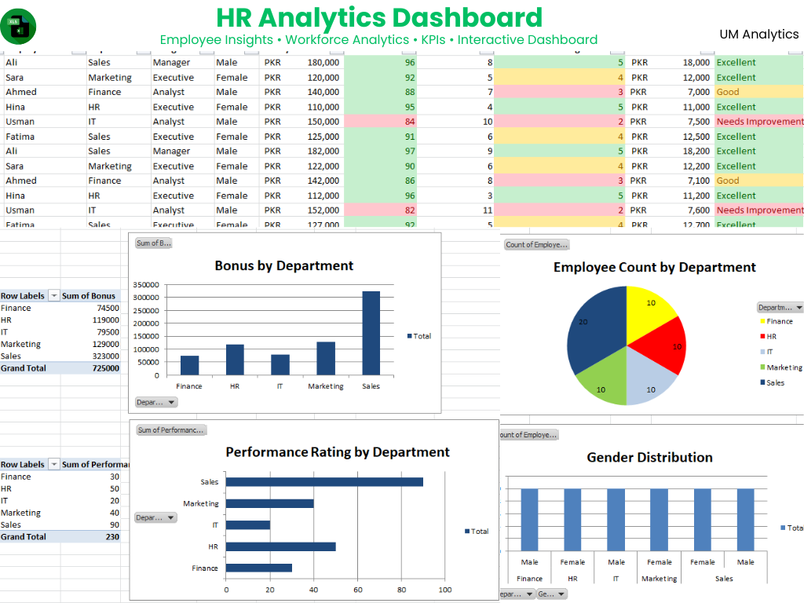

# HR Analytics Dashboard

An interactive HR Analytics Dashboard built in Microsoft Excel to analyze employee performance, workforce metrics, and key HR KPIs.

# HR Analytics Dashboard
## Dashboard Preview

## Dashboard Features

- Employee Count
- Department Analysis
- Attrition Analysis
- Gender Distribution
- Performance Metrics
- Monthly Trends
- Interactive Pivot Tables
- Charts & Visualizations
- KPI Cards

## Tools Used

- Microsoft Excel
- Pivot Tables
- Pivot Charts
- Slicers
- Conditional Formatting
- Excel Formulas

## Project Files

- HR Analytics Dashboard.xlsx

## Skills Demonstrated

- HR Analytics
- Dashboard Design
- Data Visualization
- KPI Reporting
- Business Analytics
